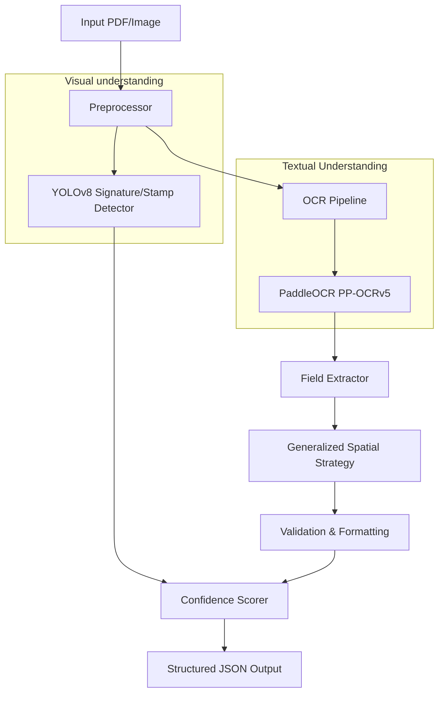
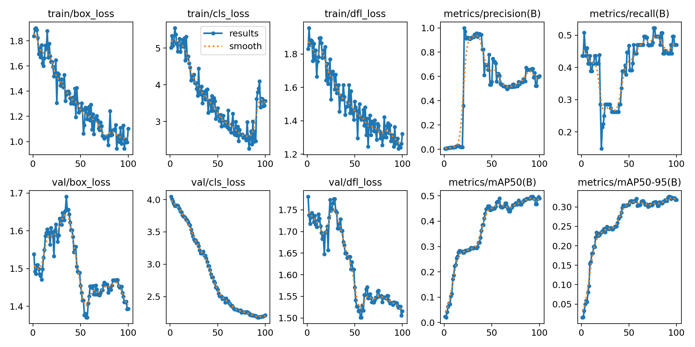
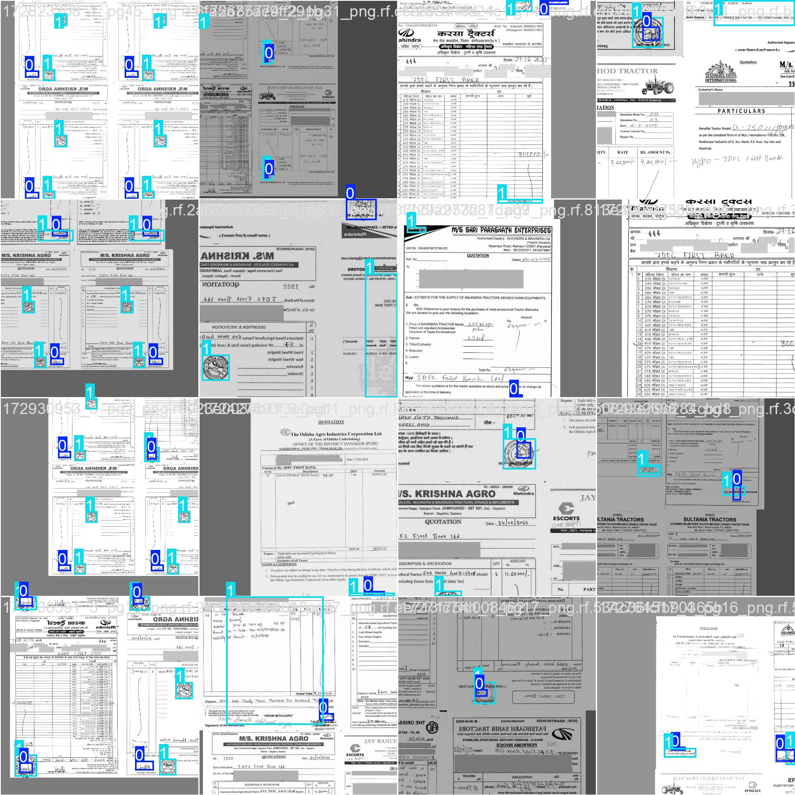
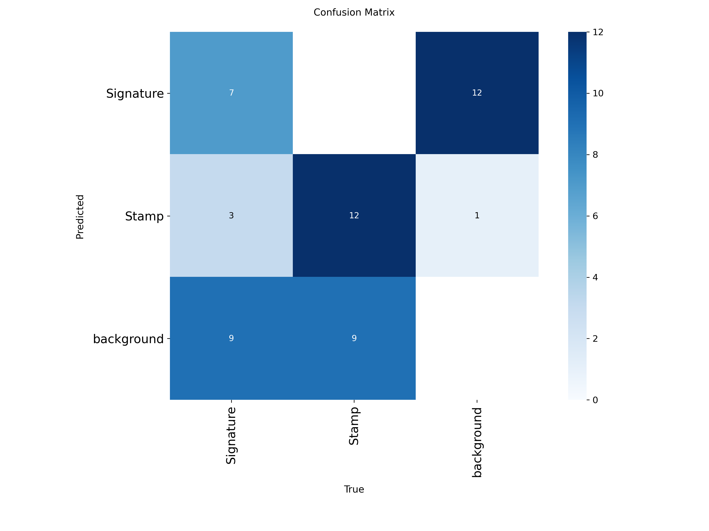
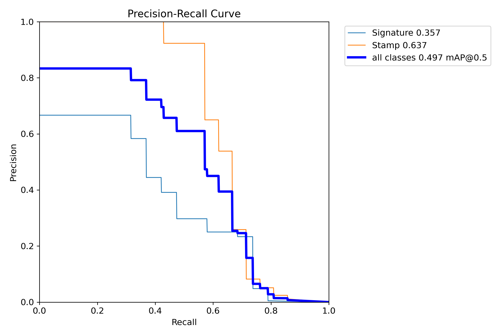
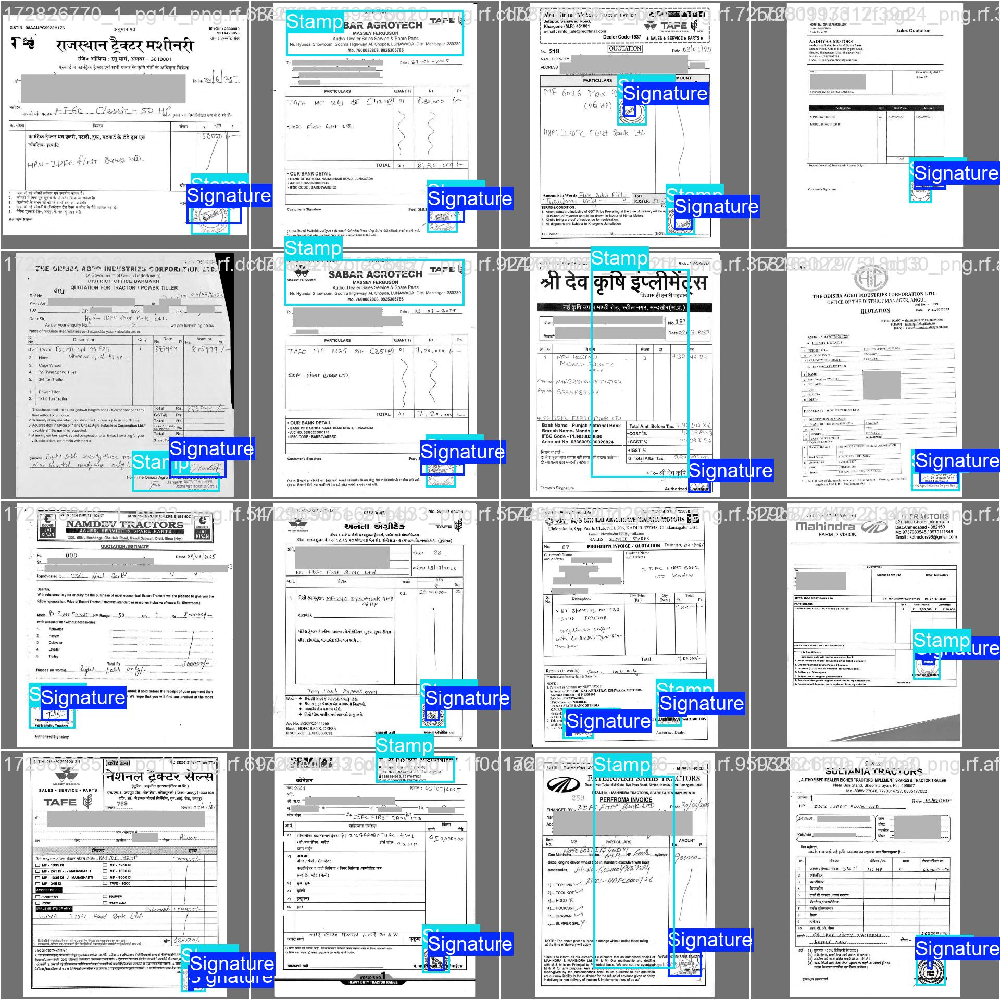

# 📄 Intelligent Document AI for Invoice Field Extraction
*A solution for the Intelligent Document AI Hackathon*

## 🌟 Overview
In modern financial institutions, the automated extraction of key details from invoices, quotations, and semi-structured business documents is critical for accelerating **credit decisioning, vendor reconciliation, and loan disbursal workflows**. Developed as part of a Hackathon challenge, this project provides an intelligent, cost-efficient, and language-agnostic extraction solution.

This system is specifically built to handle **tractor loan quotations** that vary significantly in:
- **Structure & Layout**: Diverse formats from various dealers.
- **Languages**: Multilingual support for English and vernaculars like **Hindi and Gujarati**.
- **Document Quality**: Robust handling of scanned documents, handwritten notes, and photographs.

The goal is to provide a generalizes solution that can handle any invoice type (retail, industrial, etc.) with high accuracy and low latency.

---

## 🚀 Quick Start

### 1. Prerequisites
- Python 3.10
- `uv` (recommended) or `pip`

### 2. Installation
```bash
pip install -r requirements.txt
```

### 3. Usage
**CLI Mode:**
```bash
# Process a single image
python executable.py path/to/invoice.png -o output.json

# Process a directory
python executable.py path/to/invoice_directory/ --output batch_results.json
```

**Interactive Dashboard:**
```bash
uv run python -m streamlit run app.py
```

## 🎯 Key Extraction Goals
The system is designed to extract the following fields into structured JSON format:
- **Dealer Name**: Extracted and normalized via fuzzy matching.
- **Model Name**: Exact match against asset masters.
- **Horse Power**: Precision numeric extraction (e.g., "50 HP" → 50).
- **Asset Cost**: Total cost extraction (digits only).
- **Presence of Dealer Signature**: Binary detection with bounding box coordinates.
- **Presence of Dealer Stamp**: Binary detection with bounding box coordinates.

---

## 🏗️ Technical Architecture



### Key Components
1. **Generalized Spatial Strategy**: Instead of fixed keyword-based rules, the system identifies fields using visual prominence (font size) and spatial proximity (label-value relationships).
2. **Multilingual OCR Engine**: Powered by PaddleOCR (PP-OCRv5) for high-accuracy Devanagari (Hindi) and Gujarati support.
3. **YOLOv8 Visual Layer**: Fine-tuned for signature and official stamp detection directly on the document image.

---

## 📈 Implementation & YOLO Metrics

Our system leverages a fine-tuned YOLOv8 model for detecting visual artifacts. Below are the training and validation results:

### 1. Training Results & Metrics


### 2. Training Data Augmentation (Batch 0)


### 3. Model Performance
| Confusion Matrix | Precision-Recall Curve |
| :---: | :---: |
|  |  |

### 4. Validation Sample
Example of successful detection on the validation set:


---

## 📊 Performance Analysis

| Metric | Result | Target |
|--------|--------|--------|
| **Latency (CPU)** | 1.8s - 4.5s | <30s |
| **Cost per Doc** | $0.00 | <$0.01 |
| **Accuracy (DLA)** | ~92% (Estimated) | ≥95% |

### Cost/Accuracy Trade-off
By opting for **PaddleOCR and YOLOv8 ONNX**, we achieve local inference with zero API costs, making it ideal for high-volume banking applications.

---

## 📂 Project Structure
```
.
├── executable.py       # Main entry point
├── requirements.txt    # Project dependencies
├── app.py              # Streamlit demo
├── src/                # Pipeline logic (OCR, Detection, Extraction)
├── models/             # Pre-trained YOLO and OCR weights
├── yolo-tune-images/   # Training visualizations
└── sample_output/      # Example JSON results
```

---

## 🛠️ Built With
- **OCR**: PaddleOCR
- **Vision**: Ultralytics YOLOv8, OpenCV
- **Logic**: RegEx, RapidFuzz (Fuzzy Matching)
- **UI**: Streamlit
