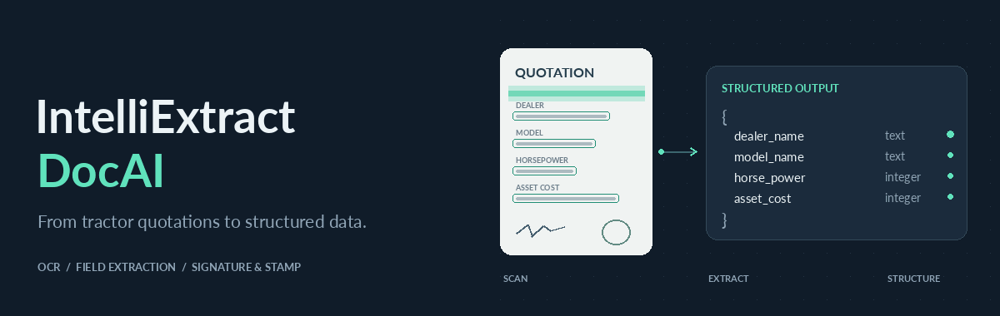
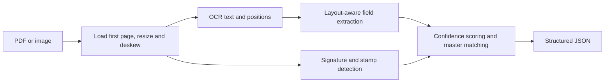
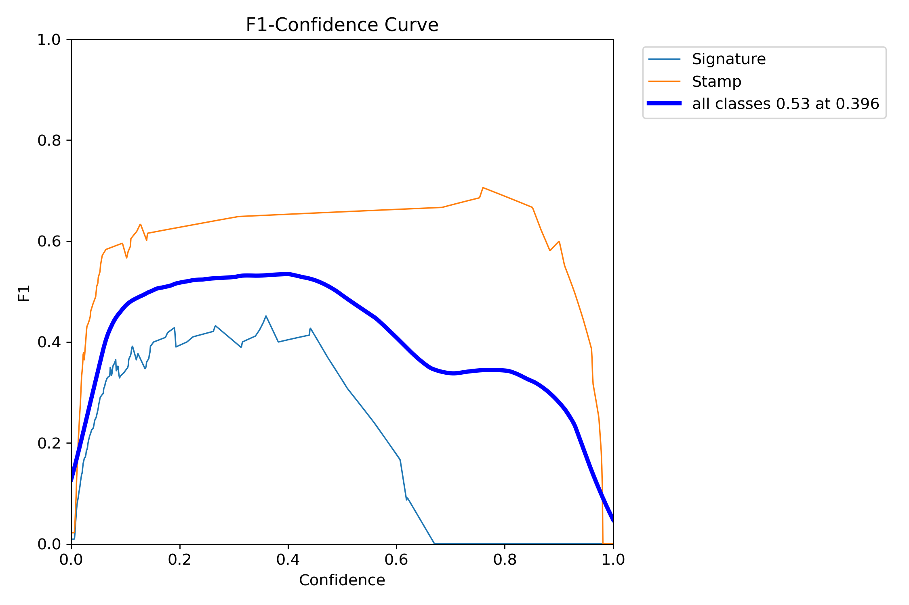
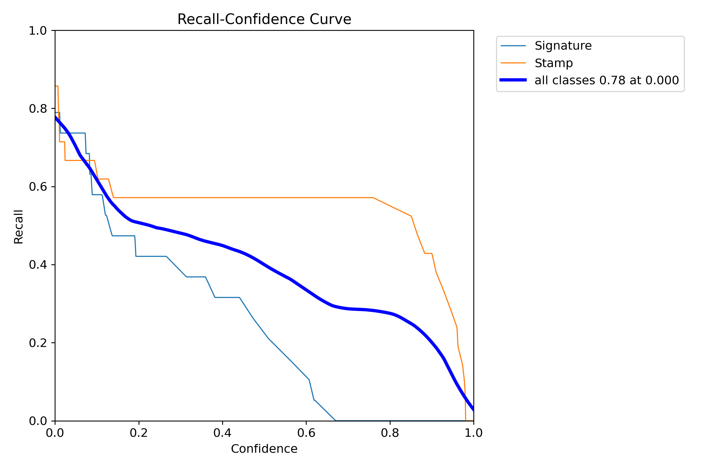
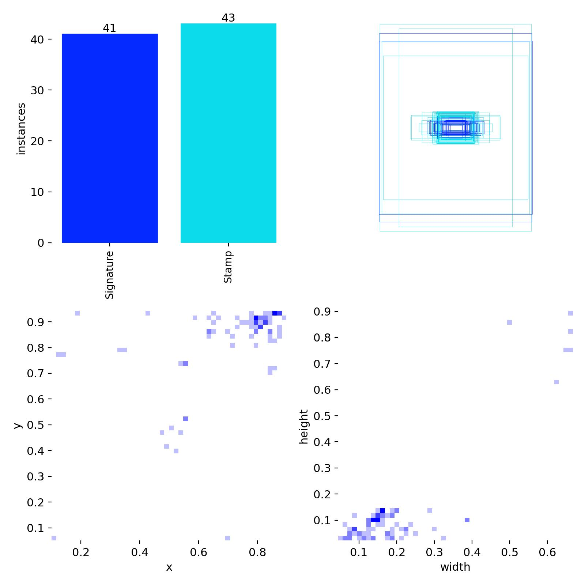

# IntelliExtract DocAI

*A prototype for Convolve 4.0 — a Pan-IIT AI/ML Hackathon*

Extract structured fields from tractor quotations using OCR, layout-aware rules, and signature/stamp detection.

Built for the hackathon’s tractor quotation extraction challenge, this project explores extraction from different dealer layouts, handwritten amounts, and stamps overlapping signatures. The pipeline reads the text, pulls out six fields, and returns JSON. You can run it from the command line or inspect results in the Streamlit app.

**Python · PaddleOCR / EasyOCR · Ultralytics YOLO · OpenCV · Streamlit**

[Quick start](#quick-start) · [Output](#structured-output) · [How it works](#how-it-works) · [Evaluation](#evaluation) · [Limitations](#scope-and-limitations)

## What it extracts

| Field | Output |
| --- | --- |
| Dealer name | Text, with fuzzy matching against the configured dealer master |
| Model name | Text, checked against the configured model master |
| Horsepower | Integer |
| Asset cost | Integer |
| Signature | Presence flag and bounding box |
| Stamp | Presence flag and bounding box |

Results also include document confidence, processing time, and master-match confidence values. Dealer and model reference data live in [`config/`](config/).

## Quick start

### Install

For the local CPU demo, use **Python 3.11** and run commands from the repository root. This setup uses the existing EasyOCR fallback; it does not require PaddleOCR.

```bash
git clone https://github.com/epawan/IntelliExtract-DocAI.git
cd IntelliExtract-DocAI
python -m venv .venv
source .venv/bin/activate
python -m pip install torch==2.6.0 torchvision==0.21.0 --index-url https://download.pytorch.org/whl/cpu
python -m pip install -r requirements-demo.txt
```

On Windows, activate the environment with `.venv\Scripts\activate`.

The original dependency list remains in `requirements.txt`. The demo list pins OpenCV to 4.11 because OpenCV 5 changes the line-array shape expected by the preserved preprocessing code.

For PDF input, install **Poppler** and make its executables available on your `PATH`; conversion uses `pdf2image`. OCR initialization may download pretrained weights, so the first run needs internet access and can take longer. Signature/stamp weights are included in [`models/`](models/README.md).

### Process a document

```bash
python executable.py path/to/quotation.png --output output/result.json
```

The CLI accepts PDF, PNG, JPEG, TIFF, and BMP files. **Only the first page of a PDF is processed.**

### Process a directory

```bash
python executable.py path/to/documents --output output/batch.json
```

Batch output wraps results in a `documents` array. Directory discovery includes PDF, PNG, JPEG, and TIFF files.

### Save detection overlays

```bash
python executable.py path/to/quotation.png --output output/result.json --visualize
```

Overlays are saved to `visualizations/`.

### Open the dashboard

```bash
python -m streamlit run app.py
```

Upload a PNG or JPEG, or select **Try a sample document**, then run extraction to inspect the input image, extracted fields, confidence, and detection overlays. The dashboard currently accepts images only; use the CLI for PDFs.

## Structured output

The [included sample result](sample_output/result.json) contains this response:

```json
{
  "doc_id": "172615659_4_pg18",
  "fields": {
    "dealer_name": "AUTHORISED DEALER TRACTORS",
    "model_name": "380SP+ 4OHP 01",
    "horse_power": 25,
    "asset_cost": 660000,
    "signature": {
      "present": true,
      "bbox": [149, 1347, 227, 1367]
    },
    "stamp": {
      "present": true,
      "bbox": [760, 1215, 944, 1388]
    },
    "dealer_match_confidence": 0.0,
    "model_match_confidence": 0.0
  },
  "confidence": 0.85,
  "processing_time_sec": 25.88,
  "cost_estimate_usd": 0.0
}
```

Bounding boxes use `[x1, y1, x2, y2]` coordinates on the preprocessed image, which may be resized and deskewed.

This is an extraction example, not verified ground truth. Both master-match scores are zero, so the extracted names require review. Its recorded processing time is **25.88 seconds**, not a benchmark across documents or hardware.

## How it works



- **OCR:** PaddleOCR with a Devanagari recognition model is preferred; EasyOCR provides a fallback.
- **Field extraction:** Keyword, numeric, and spatial rules identify quotation fields; validators help filter candidate values.
- **Visual detection:** The detector prefers the included ONNX weights, then the PyTorch weights. An OpenCV circular-stamp heuristic can supplement stamp detection.
- **Master matching:** Dealer names use fuzzy matching; model names use exact matching against YAML reference lists.

## Evaluation

The saved plots below show the signature/stamp detector's training run. They measure detection, not the accuracy of dealer names, model names, or amounts.

[Training curves](#training-curves) · [Detection quality](#detection-quality) · [Sample documents](#sample-documents)

### Training curves

[](yolo-tune-images/results.png)

The losses generally fall over the run. The final plotted mAP@50 is around **0.49**, and mAP@50–95 around **0.32**. These are approximate readings from the image; the raw metric log is not included.

### Detection quality

Click an image to open it at full size.

| Precision–recall | Confusion matrix |
| --- | --- |
| [](yolo-tune-images/BoxPR_curve.png) | [](yolo-tune-images/confusion_matrix.png) |

<details>
<summary>More curves: F1 and recall</summary>

| F1 across confidence thresholds | Recall across confidence thresholds |
| --- | --- |
| [](yolo-tune-images/BoxF1_curve.png) | [](yolo-tune-images/BoxR_curve.png) |

</details>

### Sample documents

These validation examples show the different quotation layouts and annotated signature/stamp regions. They are **ground-truth labels**, not pipeline predictions.

[](yolo-tune-images/val_batch0_labels.jpg)

<details>
<summary>See a training batch and label distribution</summary>

[](yolo-tune-images/train_batch0.jpg)

[](yolo-tune-images/labels.jpg)

</details>

Weight formats and loading behavior are documented in [`models/README.md`](models/README.md).

## Project layout

```text
IntelliExtract-DocAI/
├── executable.py       # CLI and document pipeline
├── app.py              # Streamlit interface
├── src/                # OCR, preprocessing, extraction and detection
├── config/             # Field rules and dealer/model reference lists
├── assets/             # Animated README banner
├── samples/            # Original quotations and a demo sample
├── models/             # Signature/stamp weights and model notes
├── sample_output/      # Example extraction response
├── yolo-tune-images/   # Saved detector training artifacts
├── requirements-demo.txt # CPU demo dependencies
└── requirements.txt    # Original Python dependencies
```

## Scope and limitations

- Built around **tractor quotations**. Broader invoice extraction is an extension goal, not a validated capability.
- English/Hindi handling is represented in the OCR configuration. Gujarati support and performance across languages have not been established by a published evaluation.
- OCR quality, handwriting, rotation, and unfamiliar layouts can affect extracted values. Detection indicates visual presence; it does not authenticate a signature or stamp.
- Confidence scores are heuristic signals, not measured accuracy or calibrated probabilities.
- No reproducible end-to-end benchmark or automated test suite is included. The original dependency list uses minimum version constraints; the separate CPU demo list pins the runtime tested here.
- Inference uses local libraries rather than a paid extraction API. The reported zero API cost excludes compute, storage, and setup costs.

## Background

Originally developed for the **Convolve 4.0 — a Pan-IIT AI/ML Hackathon**, this repository preserves the extraction pipeline, demo interface, model weights, and training artifacts from that work.

## Project status

This is an early-stage hackathon prototype. The application and model weights are included so the original work can be explored, but the pipeline is not production-ready.

Known gaps include incorrect overlay coordinates in the dashboard, a document-type selector that is not connected to the pipeline, and PDF upload text even though the dashboard only accepts images. Some interface labels also overstate language coverage, speed, and validation across document layouts. The detector assumes a five-class mapping, while the included ONNX model records two classes; signature/stamp results should therefore be treated with caution.

Running the app does not establish extraction accuracy. Review all extracted values and detections, and use the CLI for PDF input. These issues are documented here rather than repaired in the preserved source code.
